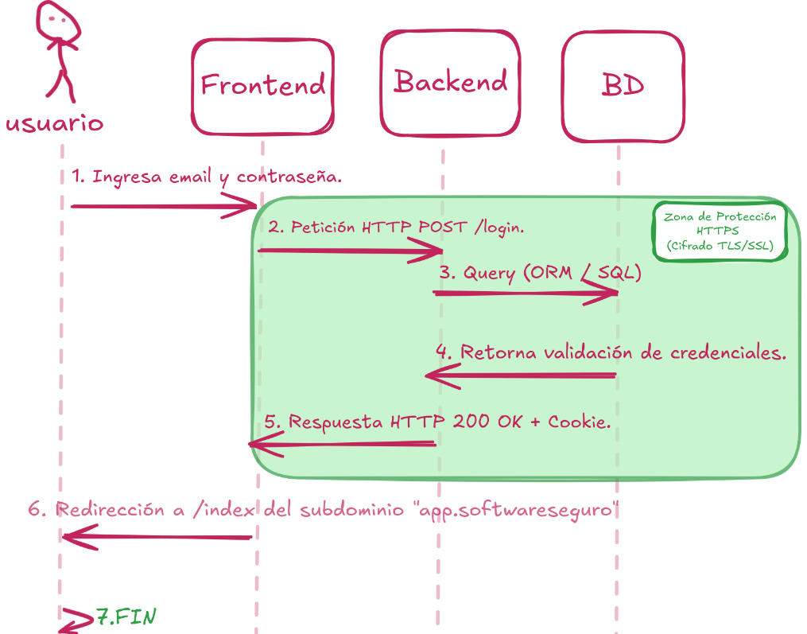

# Objetivo 1: Mapeo de Arquitectura Lógica - Proceso de Autenticación

A continuación, documenté el flujo de datos real durante un proceso de inicio de sesión en la plataforma **SoftwareSeguro**, basando el análisis en la intercepción del tráfico HTTP. El objetivo es mapear la arquitectura Cliente-Servidor y delimitar exactamente en qué tramo actúa la protección del protocolo criptográfico.

## Análisis del Flujo de Datos

### 1. Interacción del Usuario (Frontend)
El proceso inicia en el **Frontend** (Cliente). Al analizar el código fuente, observamos que la interfaz está renderizada utilizando React. El usuario ingresa su correo y contraseña en el formulario y dispara el evento de envío.

### 2. Construcción y Envío de la Petición HTTP (Frontend -> Backend)
El Frontend captura las credenciales y estructura una petición dirigida al servidor web.
*   **Método y Endpoint:** Se realiza una petición **POST** hacia `/login`. Al usar POST, las credenciales viajan encapsuladas en formato JSON dentro del cuerpo (Body) de la petición, evitando exponer información sensible en la URL.

*   **Zona de protección HTTPS (Ida):** En este salto a través de Internet, el protocolo HTTPS cifra por completo la petición mediante TLS/SSL antes de que abandone el navegador local. Si un atacante realizara un Man-in-the-Middle en la red pública, solo capturaría tráfico ilegible.

### 3. Procesamiento y Consulta a Base de Datos (Backend -> BD)
El **Backend** de la aplicación (por ejemplo, una API construida en Node.js o Python) recibe la petición HTTP cifrada y extrae el payload con el email y el password.
*   **Lógica de Acceso:** El servidor formula una consulta hacia su motor de base de datos relacional para buscar el registro del usuario. En aplicaciones modernas de este tipo, esta consulta se abstrae mediante un ORM (Object-Relational Mapping) utilizando consultas parametrizadas, lo que actúa como defensa principal frente a ataques de inyección SQL.
*   La comunicación entre la API backend y el motor de base de datos ocurre típicamente dentro de una red interna aislada, dependiendo de sus propios mecanismos de seguridad y no del túnel HTTPS inicial del cliente.

### 4. Validación de Credenciales (BD -> Backend)
La Base de Datos procesa la consulta y retorna los datos al servidor. La lógica del backend procede a comparar la contraseña enviada en la petición con el hash criptográfico almacenado.

### 5. Emisión de la Respuesta HTTP (Backend -> Frontend)
El servidor emite un HTTP Response cuyo estado depende estrictamente del paso anterior.
*   **Caso de Error:** Si las credenciales son incorrectas, el servidor devuelve un código **403 Forbidden**, acompañado de un JSON en el cuerpo: `{"message":"Usuario o contraseña incorrecta."}`.
*   **Caso de Éxito:** Si la validación es correcta, el flujo involucra la generación de un token JWT. Tras un proceso de verificación en el endpoint `/login-access`, el servidor devuelve un código **200 OK** adjuntando la cabecera `Set-Cookie: auth=...` para persistir la sesión.
*   **Zona de protección HTTPS (Vuelta):** Esta respuesta, ya contenga el mensaje de error o la cookie de sesión crítica, viaja de regreso al cliente protegida por el mismo túnel cifrado TLS/SSL establecido al inicio.

### 6. Renderizado de la Respuesta (Frontend -> Usuario)
El navegador intercepta la respuesta HTTP, la descifra y la transfiere al motor de React. Si se recibió el error 403, el frontend renderiza el mensaje de credenciales incorrectas. En el caso de éxito (200 OK y cookie configurada), el cliente procesa una redirección mediante una petición GET hacia `/index`, cargando el panel principal de los laboratorios.
